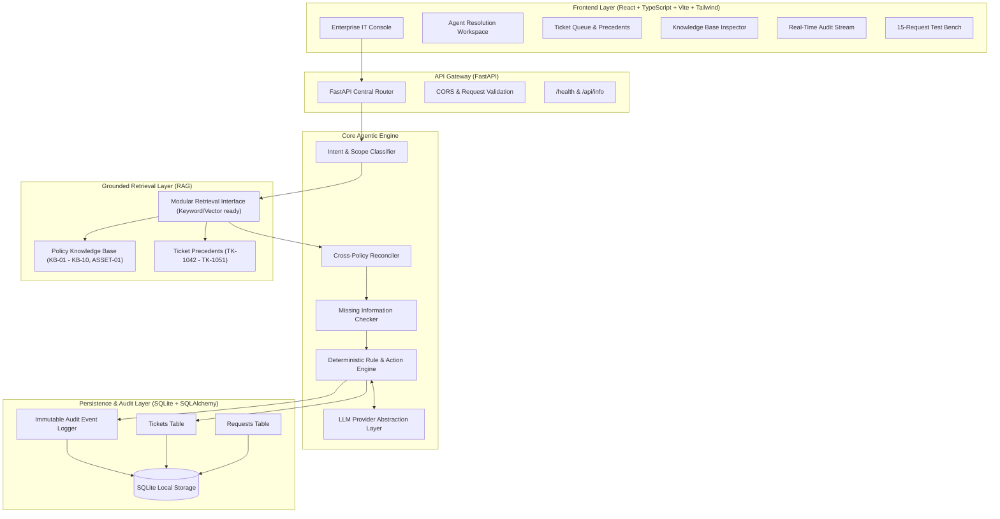
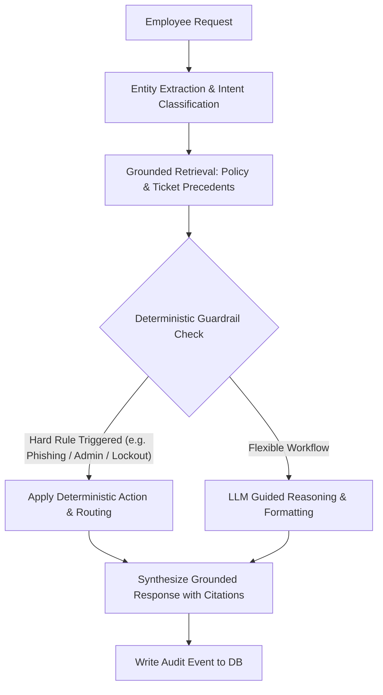
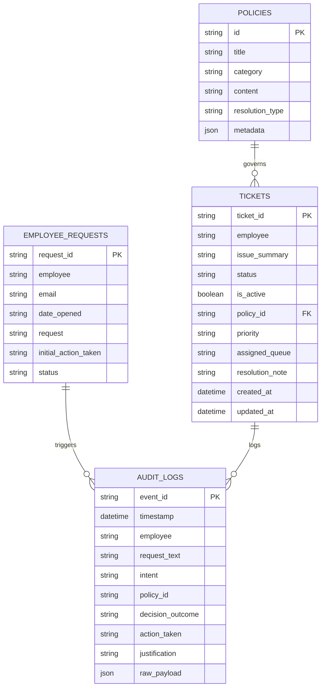

# System Architecture Document

## Product: AIONOS ResolveIT
**AI-Powered Internal IT Service & Resolution Agent**

---

### 1. High-Level Architecture Overview

AIONOS ResolveIT uses a decoupled, modular full-stack architecture designed for enterprise explainability, policy determinism, high availability, and local reproducibility.



---

### 2. Dual-Layer Decision Architecture (Policy Determinism + LLM)

A foundational architectural principle of Veridian IT Copilot is: **The LLM must never override company policy.**

To enforce this, we implement a **Dual-Layer Decision Architecture**:

1. **Deterministic Guardrail Layer (Outer/Authoritative Layer)**:
   - Evaluates hard policy boundaries (e.g. lockout attempt count ≥ 5, hardware age thresholds, forbidden actions such as forwarding phishing emails per KB-09, admin access denial per TK-1050 precedent).
   - If a request triggers a strict policy condition, the deterministic rule engine dictates the decision outcome (`RESOLVE`, `CLARIFY`, `ESCALATE`, `REJECT`) and required approval path.
2. **AI / LLM Orchestration Layer (Inner/Reasoning Layer)**:
   - Responsible for natural language comprehension, entity extraction (extracting device age, application name, error messages), empathetic and clear communication, and synthesized step-by-step guidance.
   - Operates within strict prompt constraints bounded by retrieved policy context.
   - If an external LLM key is absent or fails, the engine falls back seamlessly to the **Deterministic Offline Mock Provider** without breaking the application.



---

### 3. Replaceable LLM Provider Abstraction

The system defines an abstract base class `BaseLLMProvider` located in `backend/app/agents/llm_provider.py`:

```python
class BaseLLMProvider(ABC):
    @abstractmethod
    async def generate_response(
        self,
        prompt: str,
        system_instruction: str,
        context: Dict[str, Any]
    ) -> LLMResponse:
        pass
```

Implementations include:
- `MockRuleBasedProvider`: Built-in, fully offline, grounded deterministic engine covering all 15 scenarios and general inquiries.
- `OpenAIProvider`: Connects to OpenAI compatible endpoints (GPT-4o, etc.).
- `GeminiProvider`: Connects to Google Gemini API.

The active provider is chosen dynamically via the `LLM_PROVIDER` environment variable (`mock`, `openai`, `gemini`), making the application entirely vendor-agnostic.

---

### 4. Grounded Retrieval Layer (RAG)

The knowledge retrieval layer is decoupled from the storage mechanism:
- **Phase 1 Foundation**: In-memory indexed dictionary and keyword-scored retrieval over canonical policies (`KB-01` to `KB-10`, `ASSET-01`) and historical tickets (`TK-1042` to `TK-1051`).
- **Policy Reconciliation Unit**: Handles multi-policy scenarios, specifically reconciling:
  - `KB-03` (Laptop replacement after 3 years or verified failure)
  - `ASSET-01` (Standard 4-year refresh cycle requiring Finance sign-off for earlier replacements)
- **Vector DB Ready**: The interface `BaseRetriever` allows hot-swapping a vector store (e.g., Chroma, FAISS, or Qdrant) without altering downstream agent logic.

---

### 5. Persistence & Schema Design (SQLite & SQLAlchemy)

Local storage uses SQLite (`veridian_it.db`) with SQLAlchemy ORM models:



---

### 6. Frontend Architecture

The frontend is constructed with **React 18 + TypeScript + Vite + Tailwind CSS + Lucide React**:

1. **State Management**:
   - Clean, lightweight React hooks managing active workspace tab, live chat trajectory, ticket queue filtering, policy inspection drawer, and live audit telemetry.
2. **Enterprise UI Layout**:
   - **Top Navigation Bar**: Veridian Corp IT Copilot header, live backend connectivity status pill, temporal context banner ("Simulation Date: Mon 21 Sep - Fri 25 Sep 2026"), quick links.
   - **Primary 3-Column Console**:
     - *Column 1 (Navigation & Scenarios)*: Quick navigation between Service Desk, Ticket Queue, Policy Hub, and 15 Preloaded Employee Requests.
     - *Column 2 (Agent Triage Workspace)*: Conversation feed, diagnostic clarification forms, immediate resolution cards.
     - *Column 3 (Policy Intelligence & Audit Inspector)*: Active policy citation viewer, ticket precedent references, and live audit feed.
3. **Accessibility & Diagnostics**:
   - Status indicators, latency badges, clear error boundaries, and copyable audit events.
