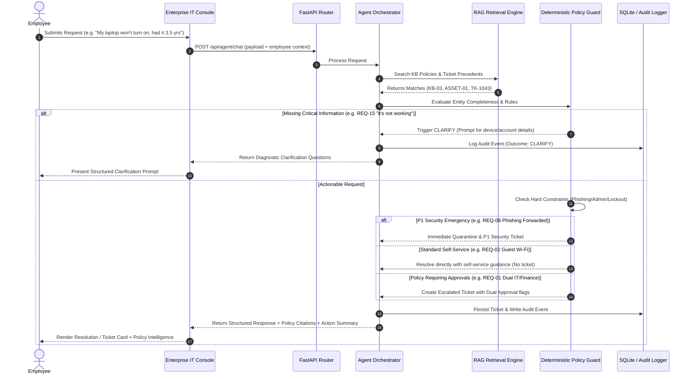
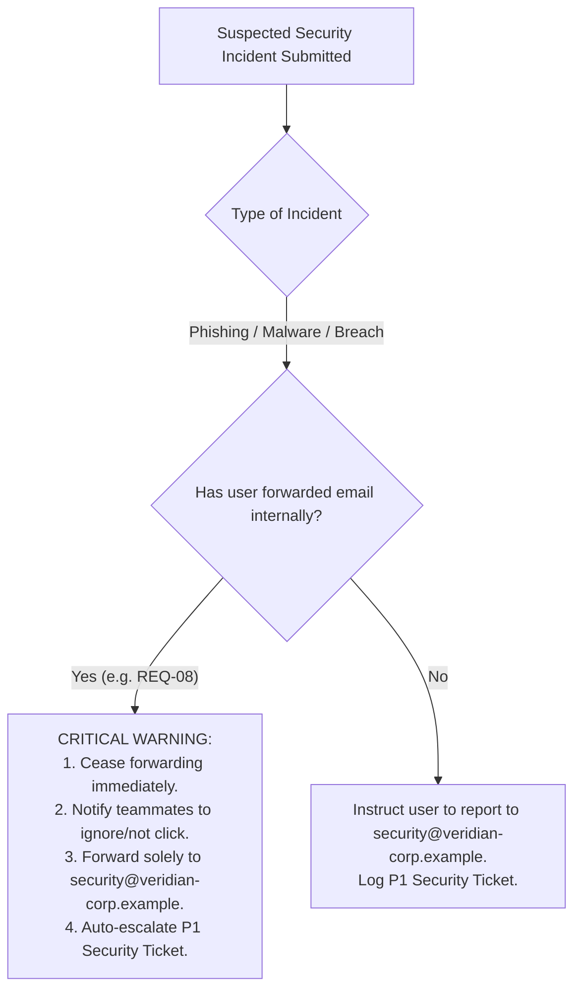
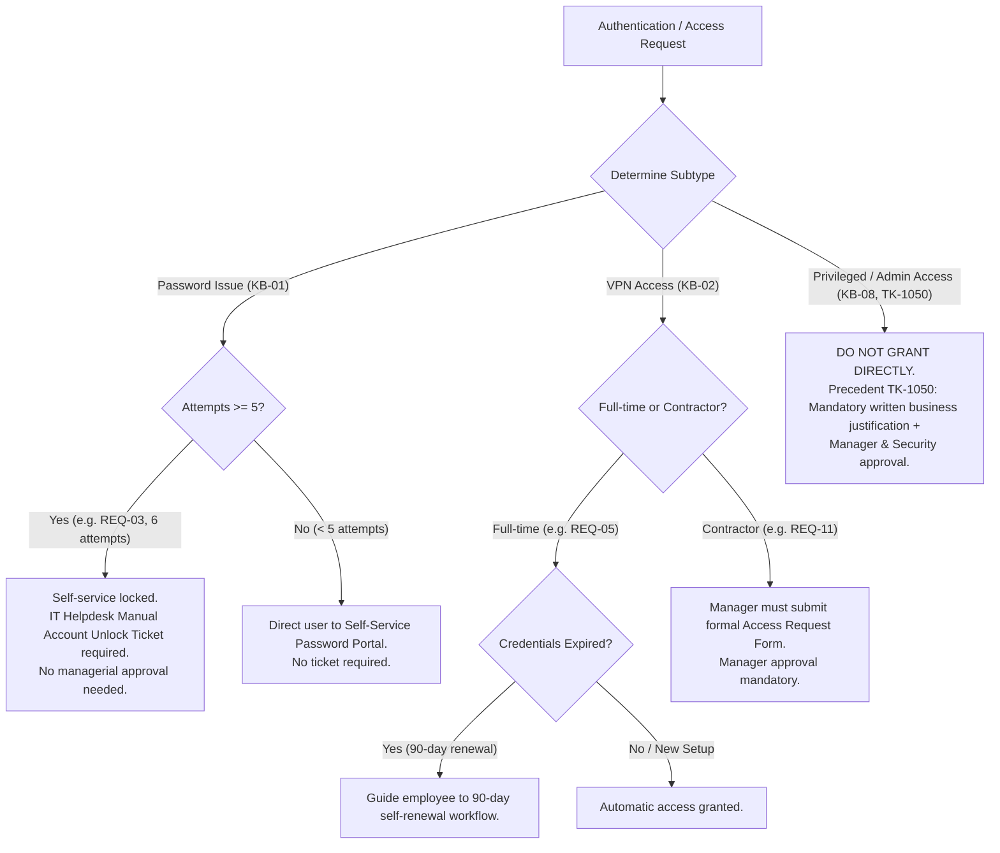
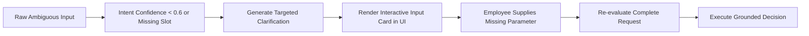

# Process Flow Documentation

## Product: Veridian IT Copilot
**Agentic Workflow & Decision Trees**

---

### 1. End-to-End Agentic Execution Pipeline

Every user request submitted to the agent executes via the following deterministic 10-step sequence:



---

### 2. Decision Trees by Category

#### 2.1 Hardware Replacement & Diagnostics (KB-03 & ASSET-01)
```mermaid
flowchart TD
    Start[Hardware Request Submitted] --> CheckAge{Verify Device Age}
    CheckAge -- "< 3 Years" --> CheckFailure{Verified Hardware Failure?}
    CheckFailure -- "No (e.g. REQ-13 Screen Flicker)" --> RouteRepair[Route to Hardware Diagnostic & Repair Technician<br/>Do NOT issue replacement ticket]
    CheckFailure -- "Yes (Verified Unrecoverable)" --> EarlyReq[Eligible for Early Replacement<br/>Requires Finance Sign-off + IT Approval]
    CheckAge -- ">= 3 Years and < 4 Years (e.g. REQ-01 3.5 yrs)" --> DualApprove[Eligible per KB-03 (>3 yrs)<br/>Mandate Finance Sign-off per ASSET-01 (<4 yrs)<br/>2 Weeks advance notice notice]
    CheckAge -- ">= 4 Years" --> StandardRefresh[Eligible per standard 4-year cycle<br/>Standard IT Approval]
```

#### 2.2 Security Incident Containment (KB-09)


#### 2.3 Access & Authentication (KB-01, KB-02, KB-08)


---

### 3. Missing Information Resolution Loop

When an employee submits an ambiguous or underspecified prompt (e.g. **REQ-15**: *"hey can you help, its not working"* or **REQ-06** without asset tag):



Clarification Rules:
1. **Never guess the system**: If an employee says "it's not working", ask:
   - What device, application, or network are you using?
   - What specific error message or visual behavior is occurring?
   - When did the issue begin?
2. **Missing Asset Tag (Printers - KB-05)**:
   - Provide print spooler restart instructions.
   - Prompt: "If the spooler restart does not clear the paper jam, please provide the printer asset tag (e.g., VER-PRN-02-04) so we can dispatch a floor technician."
